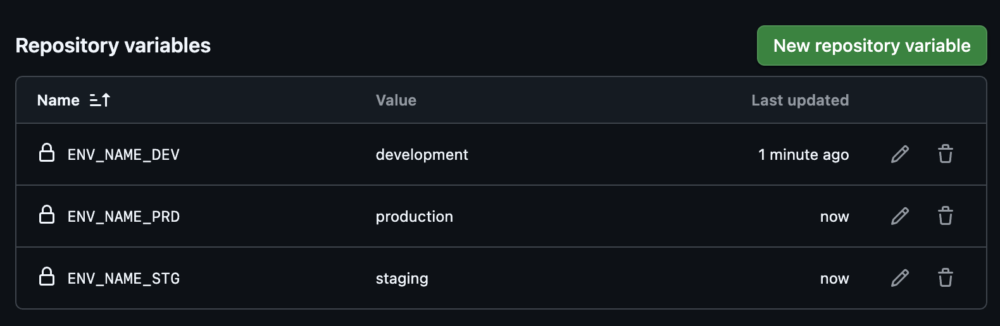

# Github Actions Dynamic Variable Access Demo

A proof-of-concept demonstrating how to dynamically access GitHub Actions variables using string indexing.

## Setup

1. Configure repository variables as shown:



2. Use the workflow [dynamic-vars.yml](.github/workflows/dynamic-vars.yml)

## How It Works

The workflow demonstrates mapping environment short names (dev, stg, prd) to full names with additional formatting using:

```yaml
${{ vars[format('env_name_{0}', inputs.env_short_name)] }}
```

This syntax dynamically constructs the variable name to access, eliminating the need for complex conditional logic.

## Usage

1. Go to Actions → "Environment Mapping Demo" → Run workflow
2. Select an environment short name
3. See how the workflow dynamically accesses the correct variable

This technique can be applied to any variables that follow a consistent naming pattern.
